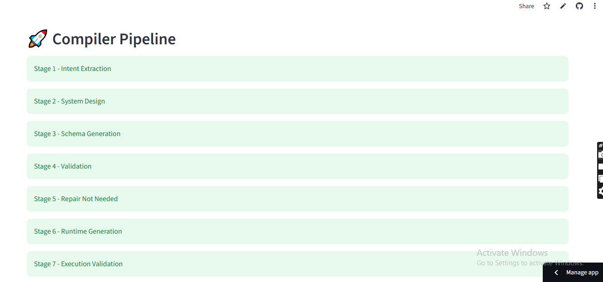
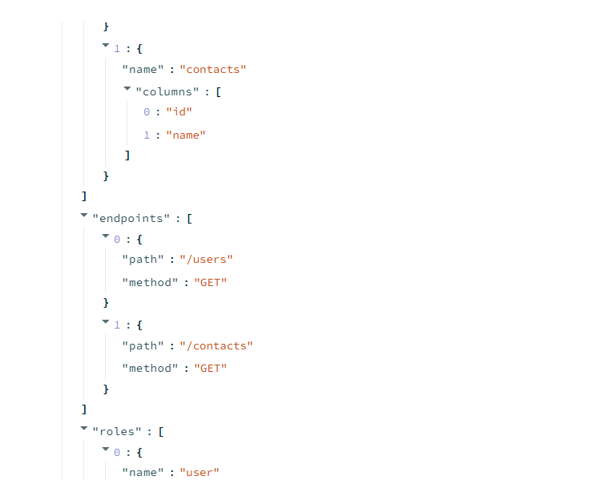
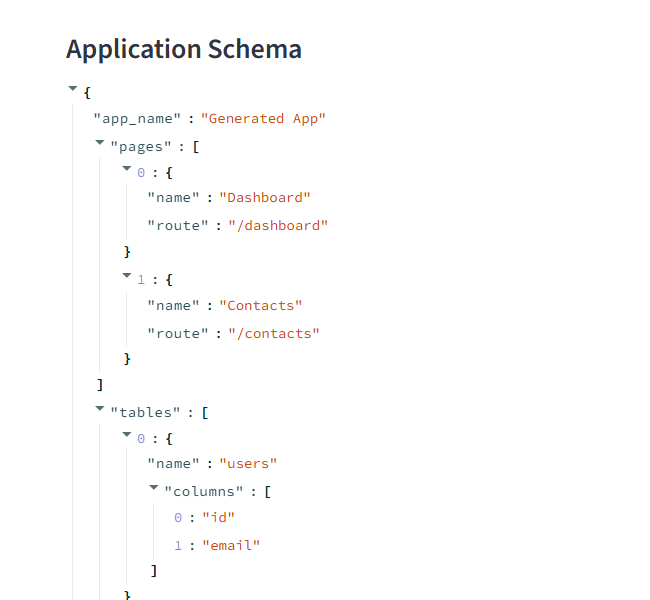
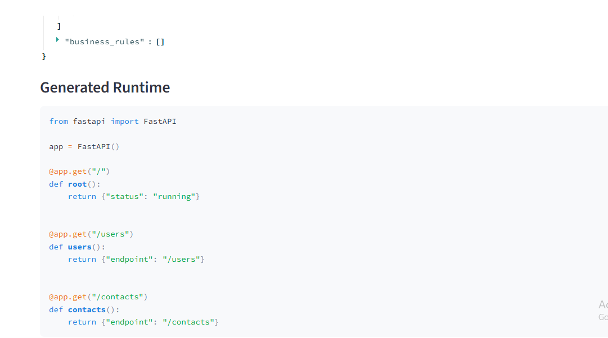
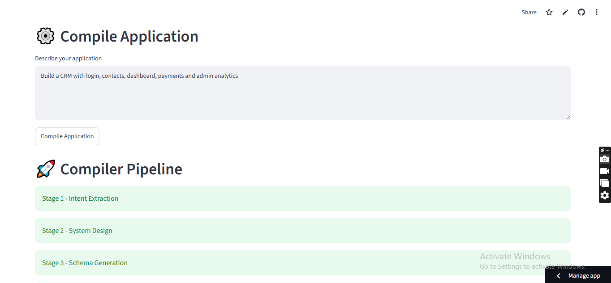
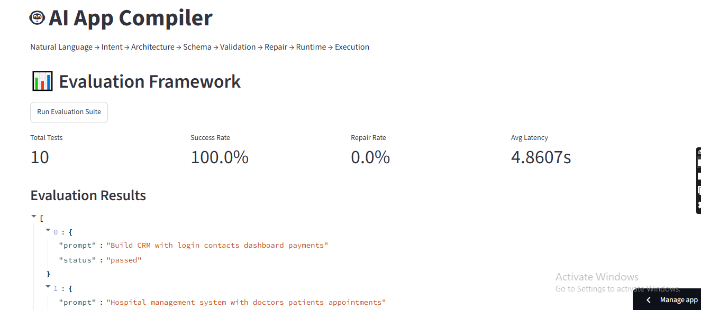

# AI App Compiler

A compiler-inspired AI system that transforms natural language software requirements into validated, executable application configurations.

## Overview

AI App Compiler converts open-ended product requirements into structured application blueprints using a multi-stage generation pipeline.

### Example Input

```text
Build a CRM with login, contacts, dashboard, role-based access, payments, and admin analytics.
```

### Generated Output

* Intent Specification
* Application Architecture
* UI Schema
* API Schema
* Database Schema
* Authentication Rules
* Business Logic Rules
* Executable Runtime

Unlike single-prompt generators, this system follows a compiler-style architecture with validation, repair, and execution-aware generation.

---

# Live Demo

**Demo URL:** https://ai-app-compiler-768uoqseziksigjvmqpocs.streamlit.app/

**GitHub Repository:** https://github.com/Harsh9572/ai-app-compiler

---

# System Architecture

```text
User Prompt
     │
     ▼
Intent Extraction
     │
     ▼
System Design Layer
     │
     ▼
Schema Generation
     │
     ▼
Validation Engine
     │
     ▼
Repair Engine
     │
     ▼
Runtime Generator
     │
     ▼
Execution Validator
     │
     ▼
Working Application
```
## Screenshots

### Home Page


### Compiler Pipeline


### Application Schema


### Generated Runtime


### Evaluation Dashboard


### Evaluation Results

---

# Multi-Stage Compiler Pipeline

## Stage 1 — Intent Extraction

Converts natural language requirements into structured application intent.

### Features

* Gemini 2.5 Flash Integration
* JSON-only Output Contract
* Intent Normalization
* Retry Mechanism
* Deterministic Fallback Extractor

### Example

```json
{
  "app_type": "CRM",
  "features": [
    "authentication",
    "contacts",
    "dashboard",
    "payments",
    "analytics"
  ],
  "roles": [
    "admin"
  ],
  "constraints": []
}
```

---

## Stage 2 — System Design Layer

Transforms application intent into architecture.

### Generates

* Entities
* Modules
* User Flows
* Role Models

### Example

```json
{
  "entities": [
    "User",
    "Contact",
    "Subscription"
  ],
  "modules": [
    "auth",
    "api",
    "database"
  ],
  "flows": [
    "login",
    "dashboard"
  ]
}
```

---

## Stage 3 — Schema Generation

Generates complete application configuration.

### UI Schema

* Pages
* Routes
* Components

### API Schema

* Endpoints
* HTTP Methods
* Validation Rules

### Database Schema

* Tables
* Fields
* Relationships

### Authentication Schema

* Roles
* Permissions
* Access Control Rules

### Business Logic

* Premium Access Rules
* Analytics Access
* Role-Based Restrictions

---

# Validation Engine

The validation layer ensures:

* Required fields exist
* Schema structure is valid
* Endpoint consistency
* Database consistency
* Cross-layer correctness

### Example

```json
{
  "valid": true,
  "errors": []
}
```

---

# Repair Engine

Automatically repairs:

* Missing tables
* Missing endpoints
* Schema inconsistencies
* Cross-layer mismatches

### Example

Before Repair:

```json
{
  "errors": [
    "CONTACTS_ENDPOINT_MISSING_TABLE"
  ]
}
```

After Repair:

```json
{
  "valid": true,
  "errors": []
}
```

---

# Runtime Generation

Generates executable FastAPI applications directly from generated schemas.

### Example

```python
from fastapi import FastAPI

app = FastAPI()

@app.get("/users")
def users():
    return {"endpoint": "/users"}

@app.get("/contacts")
def contacts():
    return {"endpoint": "/contacts"}
```

---

# Execution Validation

Generated runtimes are validated before being considered successful.

### Example

```json
{
  "execution_status": "passed"
}
```

This ensures application configurations are executable and not merely syntactically correct.

---

# Failure Handling

The system is designed for reliability.

## AI Provider Failure

If Gemini is unavailable:

```text
Gemini
   ↓
Retry
   ↓
Retry
   ↓
Retry
   ↓
Fallback Extractor
   ↓
Valid Intent
```

The compiler always returns a valid structured output.

## Ambiguous Requirements

The system:

* Applies safe defaults
* Generates valid schemas
* Preserves execution capability
* Documents assumptions

---

# Evaluation Framework

The project includes evaluation against:

### Product Prompts

* CRM Systems
* E-Commerce Platforms
* Inventory Management Systems
* Learning Management Systems
* Hospital Management Systems

### Edge Cases

* Vague Requirements
* Missing Features
* Contradictory Requests
* Incomplete Specifications

### Metrics

* Success Rate
* Repair Rate
* Average Latency
* Failure Types

Example:

```json
{
  "total_tests": 10,
  "success_rate": 100.0,
  "repair_rate": 0.0,
  "avg_latency": 0.0473
}
```

---

# Technology Stack

* Python
* Streamlit
* FastAPI
* Pydantic
* Google Gemini 2.5 Flash
* JSON Validation

---

# Project Structure

```text
ai-app-compiler/
│
├── app.py
├── config.py
├── requirements.txt
├── README.md
├── .env.example
├── .gitignore
│
├── pipeline/
│   ├── gemini_client.py
│   ├── json_utils.py
│   ├── intent_extractor.py
│   ├── intent_normalizer.py
│   ├── system_designer.py
│   ├── schema_generator.py
│   ├── validator.py
│   ├── repair_engine.py
│   ├── runtime_generator.py
│   └── execution_validator.py
│
├── schemas/
│   ├── intent.py
│   ├── architecture.py
│   └── final_output.py
│
├── evaluation/
│
├── runtime/
│   └── generated/
│
└── tests/
    ├── test_config.py
    ├── test_env.py
    ├── test_evaluation.py
    ├── test_gemini.py
    ├── test_gemini_raw.py
    ├── test_intent.py
    ├── test_repair.py
    ├── test_runtime.py
    └── test_validator.py
```

---

# Installation

Clone Repository

```bash
git clone https://github.com/Harsh9572/ai-app-compiler.git
cd ai-app-compiler
```

Install Dependencies

```bash
pip install -r requirements.txt
```

Create Environment File

```env
GEMINI_API_KEY=YOUR_GEMINI_API_KEY_HERE
```

Run Application

```bash
streamlit run app.py
```

---

# Testing

Run Individual Tests

```bash
python tests/test_intent.py
python tests/test_validator.py
python tests/test_repair.py
python tests/test_runtime.py
```

Run Evaluation Suite

```bash
python tests/test_evaluation.py
```

---

# Key Engineering Principles

* Multi-Stage Generation Pipeline
* Compiler-Inspired Architecture
* Validation-First Design
* Automatic Repair
* Execution Awareness
* Deterministic Fallback Handling
* Production-Oriented Reliability

---

# Future Improvements

* Dynamic Database Relationship Generation
* Multi-Model Provider Support
* Advanced Role-Based Permission Graphs
* Automatic Frontend Code Generation
* Containerized Runtime Deployment

---

# Author

**Harsh Kumar**

B.Tech Information Technology
Galgotias College of Engineering & Technology

AI Engineer Demo Task Submission
